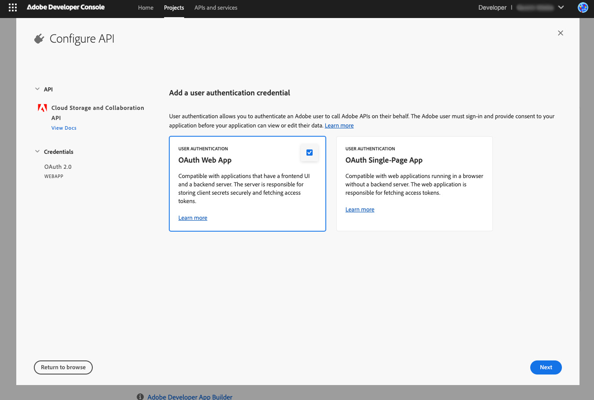

# Authentication setup

Learn how to authenticate requests to the Adobe Cloud Storage and Collaboration API.

## Overview

Every request made to Adobe Cloud Storage and Collaboration APIs must include an encrypted access token. Your secure, server-side application retrieves an access token by making a request to the [Adobe Identity Management System (IMS)](https://www.adobe.com/content/dam/cc/en/trust-center/ungated/whitepapers/corporate/adobe-identity-management-services-security-overview.pdf), using your Client ID and Client Secret.

## Prerequisites

Before proceeding, work with your Adobe Representative and ensure you have the following:

- An [Adobe Developer Console](https://developer.adobe.com/) account.
- An [Adobe Developer Console project](https://developer.adobe.com/developer-console/docs/guides/projects/projects-empty/) with [OAuth server-to-server](https://developer.adobe.com/developer-console/docs/guides/services/services-add-api-oauth-s2s) or [OAuth user authentication](https://developer.adobe.com/developer-console/docs/guides/services/services-add-api-oauth-user-authentication) credentials for the Adobe Cloud Storage and Collaboration APIs.
- Access to your Client ID and Client Secret from the [Adobe Developer Console project](https://developer.adobe.com/developer-console/docs/guides/services/services-add-api-oauth-s2s#api-overview). Securely store these credentials and never expose them in client-side or public code.

## Retrieve a server-to-server access token

Perform the following steps:

1. Open a secure terminal and export your **Client ID** and **Client Secret** as environment variables:

   ```json
   export CLOUD_STORAGE_CLIENT_ID=yourClientIdAsdf123
   export CLOUD_STORAGE_CLIENT_SECRET=yourClientSecretAsdf123
   ```

2. Run the following command to generate an access token:

   ```json
   curl --location 'https://ims-na1.adobelogin.com/ims/token/v3' \
   --header 'Content-Type: application/x-www-form-urlencoded' \
   --data-urlencode 'grant_type=client_credentials' \
   --data-urlencode "client_id=$CLOUD_STORAGE_CLIENT_ID" \
   --data-urlencode "client_secret=$CLOUD_STORAGE_CLIENT_SECRET" \
   --data-urlencode 'scope=openid, AdobeID, offline_access, creative_sdk'
   ```

   A sample response is as follows:

    ```json
    {
      "access_token": "yourAccessTokenAsdf123",
      "token_type": "bearer",
      "expires_in": 86399
    }
    ```

   The expires_in field indicates the token’s validity in seconds, typically, 24 hours. Your application should securely store the token and refresh it before expiration.

3. Export your access token as an environment variable:

   ```json
   export FIREFLY_SERVICES_ACCESS_TOKEN=yourAccessTokenAsdf123
   ```

### Technical account privileges

===TODO: add section about making the TA a storage admin===

## Retrieve a user access token

===TODO: add section about configuring for a User access token===
===TODO: redirect to [This link](https://developer.adobe.com/developer-console/docs/guides/authentication/UserAuthentication/ims#fetching-access-tokens)===


