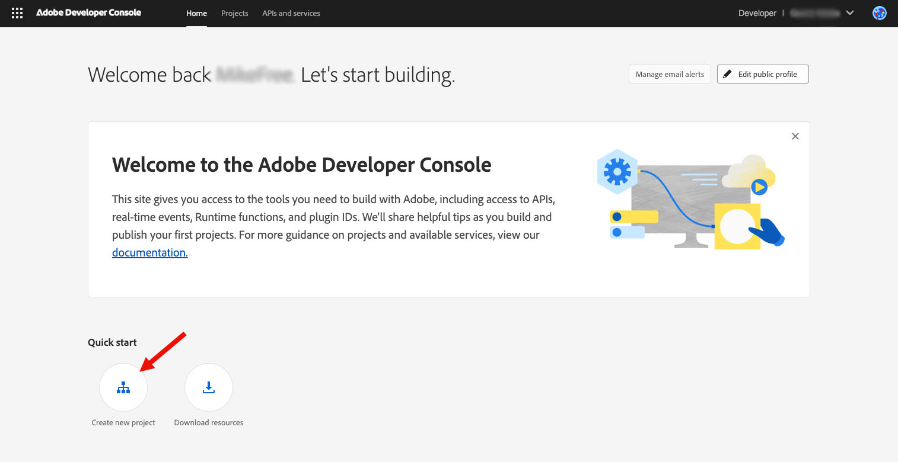
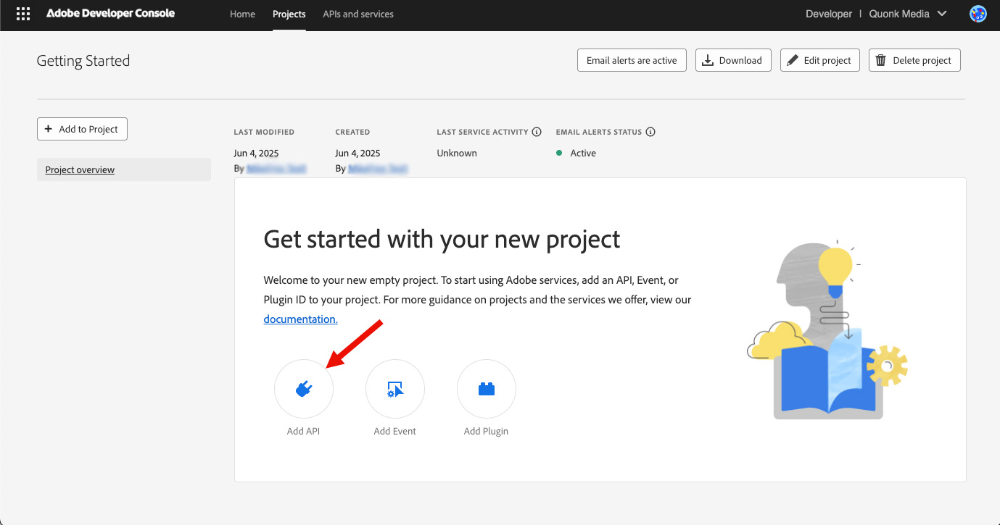
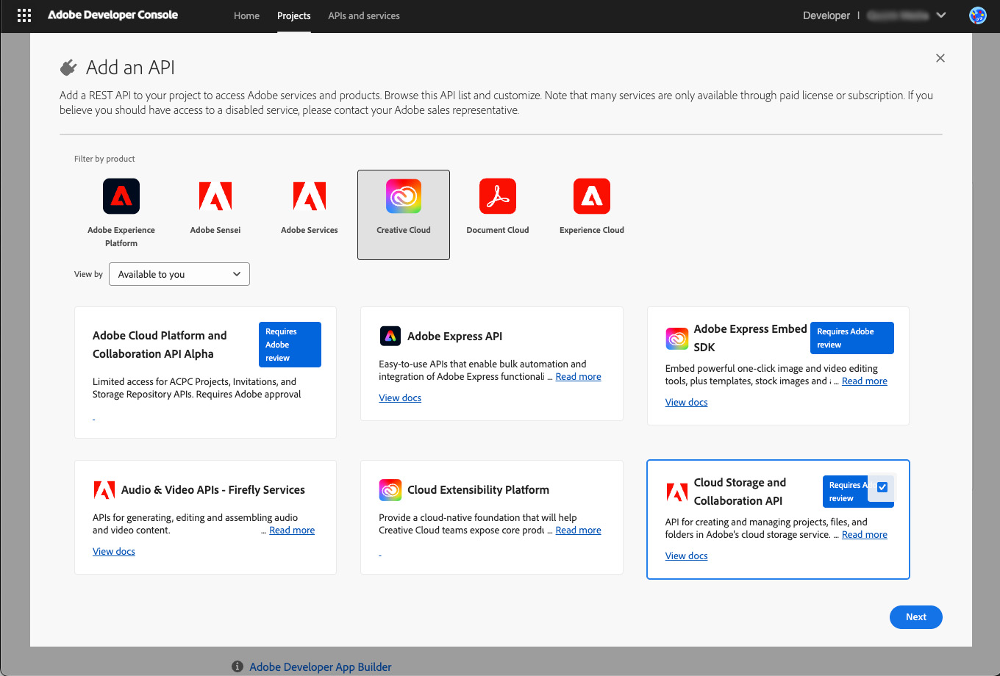
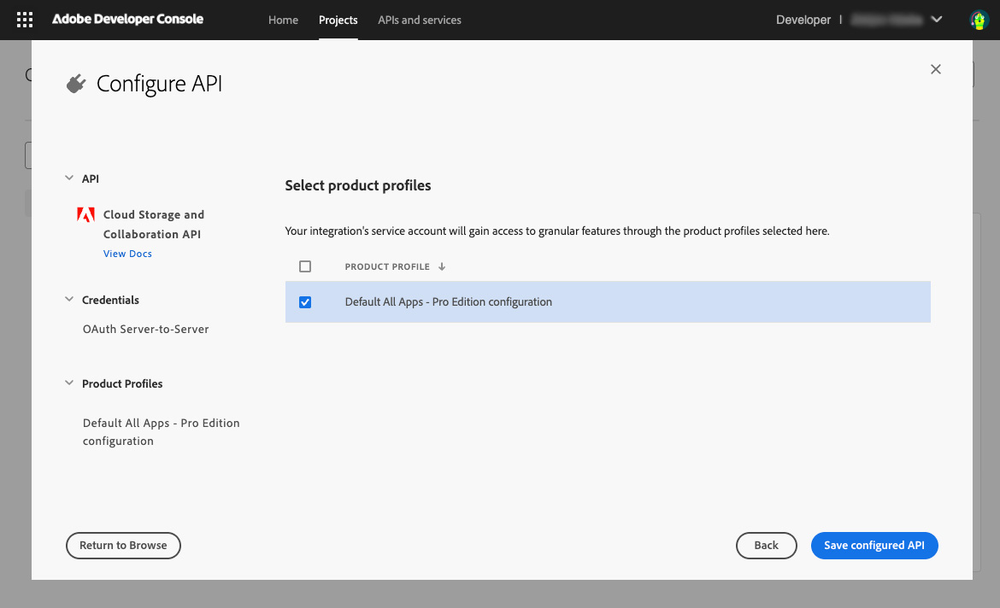

# Generate API key and access token through Adobe Developer Console

The **Adobe Developer Console** is an administration interface that enables developers to manage Adobe's APIs and services, including the Cloud Storage and Collaboration API.

## Prerequisite: Gaining access to the Adobe Developer Console

Enterprise users must be assigned the **System Administrator** or **Developer** role in the Adobe Admin Console to access the Adobe Developer Console.

- Identify an Adobe Admin in your organization. This may be as simple as checking the notes in your Adobe account, or you can ask your Adobe solution consultant for the appropriate contact.
- Ask the Admin to set up either **System Administrator** or **Developer roles** for users who need to generate API keys.
  - Alternatively, ask your Admin to generate the keys if they prefer not to elevate roles.
- If your Admin allows you to generate your API keys, the Admin must also assign an Adobe product that uses Enterprise Storage to you in the Admin Console.

## Steps to generate an API Key and access token

Follow these steps to create a project and generate credentials in the Adobe Developer Console once your organization has provisioned developer access,

### Step 1: Create a project

1. Go to [https://developer.adobe.com/console/home](https://developer.adobe.com/console/home) and sign in to the Developer Console.
2. Select **Create new project** under the **Quick start** section in the middle of your screen:

### Step 2: Add the API to your project

1. Choose Add API.
2. Select **Add API**.

   

3. Select **Adobe Cloud Storage and Collaboration API** and click **Next**:

   

### Step 3: Set Credentials

1. Choose the type of authentication.
2. Choose your preferred authentication method:

   - **Server-to-Server Authentication** allows your application's server to generate access tokens and make API calls on behalf of your application itself. Choose this if your app needs to operate independently of user interaction. [Learn more](https://developer.adobe.com/developer-console/docs/guides/authentication/ServerToServerAuthentication/).
   - **User Authentication** enables your application to make API calls on behalf of a signed-in Adobe user. [Learn more](https://developer.adobe.com/developer-console/docs/guides/authentication/UserAuthentication/).

     - If you choose User Authentication, you will need to select the credential type from **OAuth Web App credential** or **OAuth Single Page App credential**. [Learn more](https://developer.adobe.com/developer-console/docs/guides/authentication/UserAuthentication/implementation).

     

3. Give your credential a name and click **Next**.

### Step 4: Select Product Profiles

Depending on the API you add, you may be prompted to select product profiles to assign to your credential. These profiles define what data your application can access within your organization.

Choose the appropriate product profile(s) and select **Save configured API**.

### Step 5: Add More Authentication Credentials and APIs

You can add other credentials using the **Connect another credential** button on the Developer Console project page.

To add more APIs to your project, repeat [step 2](#step-2-add-the-api-to-your-project) until all required APIs are included.

### Step 6: Generate access token

Access tokens can be generated or refreshed in two ways:

- **Manual generation:** Click **Generate access token** in the Developer Console for quick testing and experimentation.
- **Programmatic generation:** Click **View cURL command** to learn how to generate access tokens programmatically. [Learn more](https://developer.adobe.com/developer-console/docs/guides/authentication/ServerToServerAuthentication/implementation/) about how to do it.

### Scopes

Scopes define the specific actions or data your application is allowed to access. As a security best practice, your application should request only the minimum scopes necessary to function properly.

Click **View scopes per service** to see the available services and their scopes.

Congratulations! You have successfully generated an access token.

### Account Configuration

Access to content in Adobe cloud storage is limited to authorized users.

- API calls made with an **OAuth user credential** use a user token to make the request on behalf of a specific user. Access to the content is based on user's [roles and permissions](../overview/permissions.md).
- API calls made using **OAuth Server-to-Server** are made using a Technical Account. This account is created automatically when you added Server-to-Server authentication to your Developer Console Project. However, you must ensure the Technical Account is properly configured. For step-by-step instructions, refer to the [Technical Account setup guide](./technical-account-setup.md).
