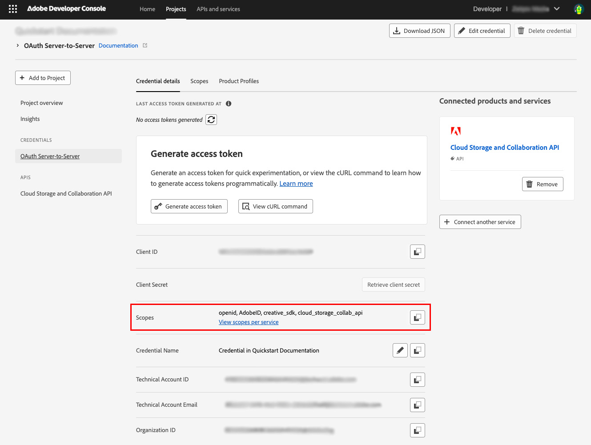
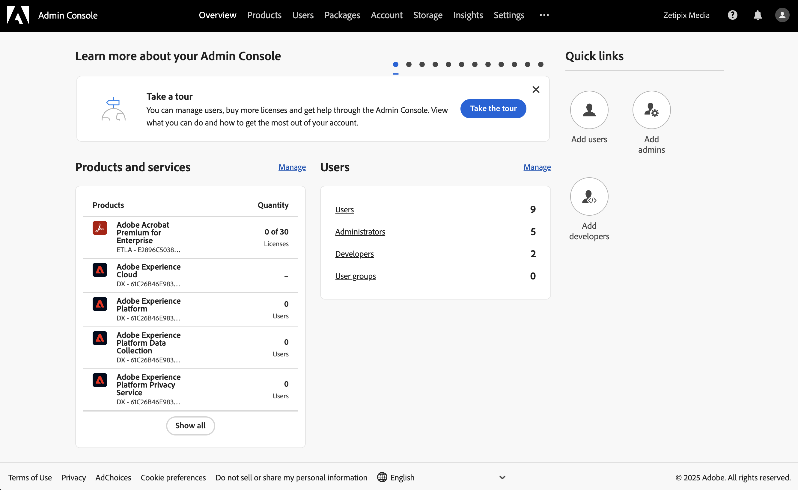
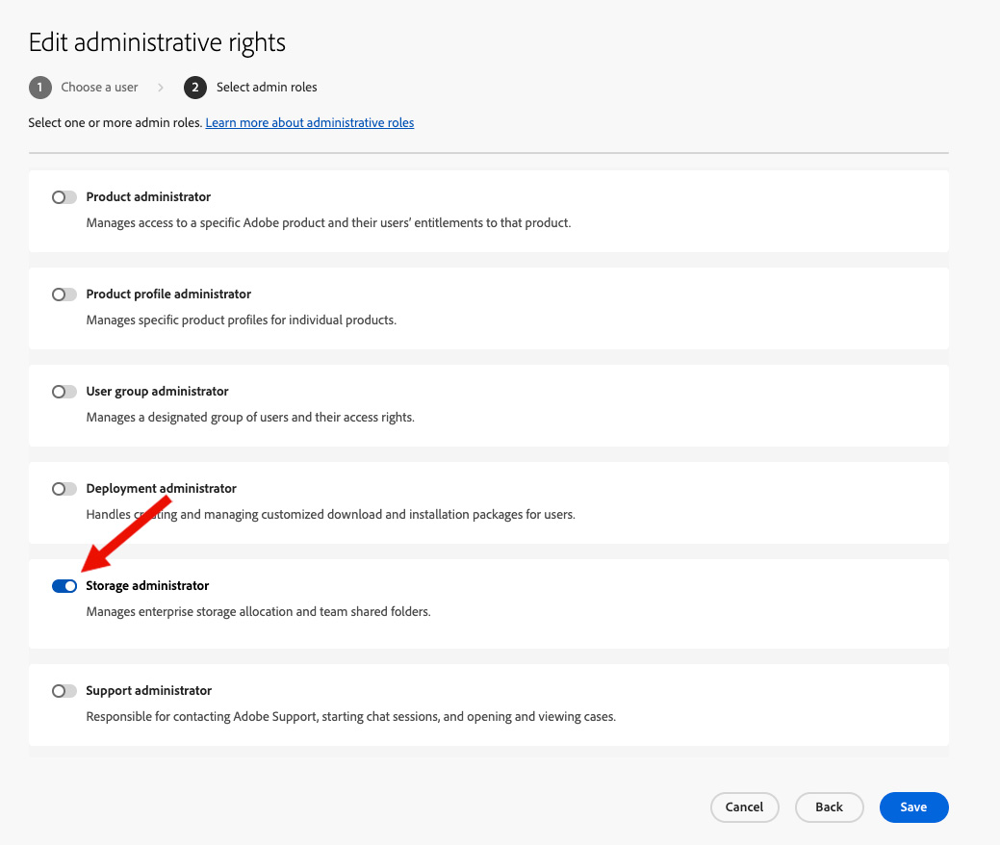

# Getting started with the Adobe Cloud Storage and Collaboration API

The first step in accessing the Adobe Cloud Storage and Collaboration API is authentication. For that, you will need an access token and an API Key. The steps below explain how to generate an access token and make your first API call.

## Overview

Follow these steps to get started with the Adobe Cloud Storage and Collaboration API. If you already have your credentials, you can skip ahead to the [Adobe Cloud Storage and Collaboration API Quickstart Guide](../quick-start/index.md) to begin working with Adobe cloud storage.

## Gaining access to the Adobe Developer Console

Enterprise customers must be assigned the **System Administrator** or **Developer** role in the Adobe Admin Console to access the Adobe Developer Console.

- Identify an Adobe Admin in your organization. This may be as simple as checking the notes in your Adobe account, or you can ask your Adobe solution consultant for the appropriate contact.
- Ask the Admin set up either **System Administrator** or **Developer roles** for users who need to generate API keys.
  - Alternatively, ask your Admin to generate the keys if they prefer not to elevate roles.
  - If your Admin does this for you, skip to the [Make your first API Call](#make-your-first-api-call) section.
- If your Admin allows you to generate your API keys, the Admin also must assign the **Adobe Cloud Storage and Collaboration** product to you in the Admin Console.

## Generate an API Key and access token

If your organization has provisioned access, follow these steps to create a project and generate credentials in the Adobe Developer Console.

### Step 1: Create a project

1. Go to [https://developer.adobe.com/console/home](https://developer.adobe.com/console/home) and sign in to the Developer Console.
2. Select **Create new project** under the **Quick start** section on the middle of your screen:


### Step 2: Add API to your project

1. Select **Add API**.

   

2. Select **Adobe Cloud Storage and Collaboration API** and click **Next**:

   

### Step 3: Set Credentials

1. Choose your preferred authentication method:

   - **Server-to-Server Authentication** allows your application's server to generate access tokens and make API calls on behalf of your application itself. Choose this if your app needs to operate independently of user interaction. [Learn more](https://developer.adobe.com/developer-console/docs/guides/authentication/ServerToServerAuthentication/).
   - **User Authentication** enables your application to make API calls on behalf of a signed-in Adobe user. [Learn more](https://developer.adobe.com/developer-console/docs/guides/authentication/UserAuthentication/).

     - If you choose User Authentication, you will need to select the credential type from **OAuth Web App credential** or **OAuth Single Page App credential**. [Learn more](https://developer.adobe.com/developer-console/docs/guides/authentication/UserAuthentication/implementation).

     

2. Give your credential a name and click **Next**.

### Step 4: Select product profiles

Depending on the API you add, you may be prompted to select product profiles to assign to your credential. These profiles define what data your application can access within your organization.

Choose the appropriate product profile(s) and select **Save configured API**.


### Step 5: Add more authentication credentials and APIs

You can add other credentials using the **Connect another credential** button on the Developer Console project page.

To add more APIs to your project, repeat [step 2](#step-2-add-api-to-your-project) until all required APIs are included.


### Step 6: Generate access token

Access tokens can be generated or refreshed in two ways:

- **Manual generation:** Click **Generate access token** in the Developer Console for quick testing and experimentation.
- **Programmatic generation:** Click **View cURL command** to learn how to generate access tokens programmatically. [Learn more](https://developer.adobe.com/developer-console/docs/guides/authentication/ServerToServerAuthentication/implementation/) about how to do it.

#### Scopes

Scopes define the specific actions or data your application is allowed to access. As a security best practice, your application should request only the minimum scopes necessary to function properly.

Click **View scopes per service** to understand the services and scopes associated with it.



Congratulations! You have successfully generated an access token.

## Technical Account permissions

Access to content in Adobe cloud storage is limited to authorized users.

- API calls made with an **OAuth user credential** use a user token to make the request on behalf of a specific user. Access to the content is based on user's [roles and permissions](../concepts/permissions/index.md).
- API calls made using **OAuth Server-to-Server** are made using a Technical Account. This account is created automatically when you added Server-to-Server authentication to your Developer Console Project. However, you must grant the Technical Account permissions to allow it to access the Adobe cloud storage conent.

**Grant permissions to the Technical Account**

**Note:** You must be an Administrator for your organization to grant permissions to the Technical Account.

1. Sign in to the [Adobe Admin Console](https://adminconsole.adobe.com) using your user account profile for your organization.
2. Go to the **Users** tab

   

3. Choose **API Credentials** from the menu on the left.
4. Locate the credential you created earlier in the list. Click **View details** icon to see information about the credential.

   

5. Copy the Technical Account's username data.

   

6. Choose **Administrators** from the menu on the left.
7. Select **Add admin** button.

   

8. Paste the Technical Account's user name in the **Email or username** field and click the drop down button next to the field.

   

9. Select the user name from the list and click **Next**.

   

10. Select **Storage administrator** and click **Save**. This will make the Technical Account a Storage Administrator, which gives the account access to all of the content in your organization's Adobe cloud storage.



## Make your first API call

Once you have created your access token, you can follow the steps below to make your first API call.

- Open your terminal and paste the code below.
- Replace the variables `<YOUR_ACCESS_TOKEN>` with the token you generated on the Adobe Developer Console.
- Replace `<YOUR_CLIENT_ID>`. You can find this on the same page you generated your token on.
- Once all variables have been replaced you can run the command.

```json
curl --request GET \
  --url 'https://cloudstorage.adobe.io/v1//projects?limit=20' \
  --header 'Authorization: Bearer <YOUR_ACCESS_TOKEN>' \
  --header 'Content-Type: application/vnd.adobecloud.directory+json' \
  --header 'x-api-key: <YOUR_CLIENT_ID>'
```

Congratulations! You yave just made your first request to the Cloud Storage and Collaboration API.

**Note:** Access tokens expire every 24 hours. Be sure to refresh them as needed.

#### Start building your applications

Now that you have obtained an Access Token and Client ID, you are ready to develop your application with Cloud Storage and Collaboration API.

Explore the [Quickstart guide](../quickstart/index.md) for a working example to help you get started.
