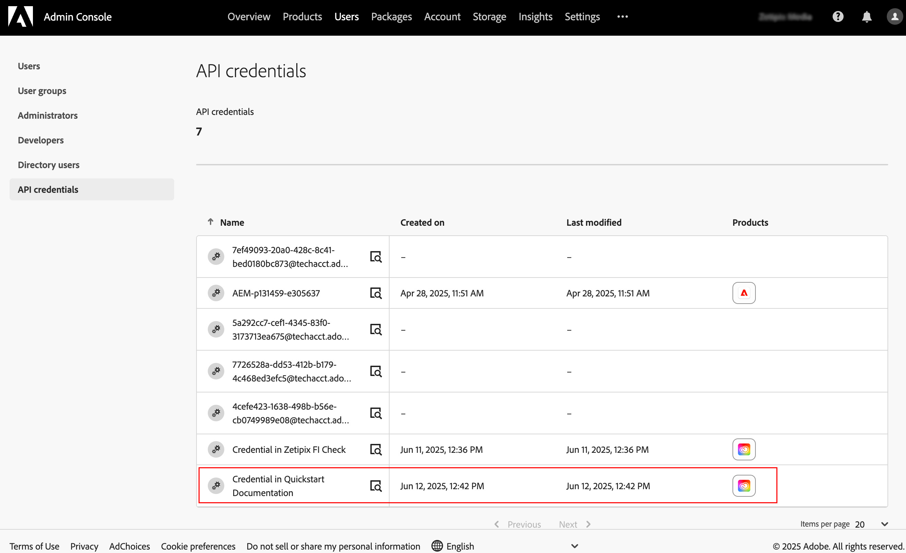

API calls made using **OAuth Server-to-Server** are made using a Technical Account. This account is created automatically when you added Server-to-Server authentication to your Developer Console Project (refer to [Generate API key and access token](./developer-console.md) for instructions). However, you must configure the Technical Account permissions and product assignments to allow it to access the Adobe cloud storage content.

**Note:** You must be an Administrator for your organization to configure the Technical Account.

## Technical Account permissions

To grant permissions to the Technical Account:

1. Sign in to the [Adobe Admin Console](https://adminconsole.adobe.com) using your user account profile for your organization.
2. Go to the **Users** tab

   

3. Choose **API Credentials** from the menu on the left.
4. Locate the credential associated with the Developer Console project that needs access to Adobe cloud storage. Click **View details** icon to see information about the credential.

   

5. Copy the Technical Account's username email address.

   

6. Choose **Administrators** from the menu on the left.
7. Select **Add admin** button.

   

8. Paste the Technical Account's user email address in the **Email or username** field and click the drop down button next to the field.

   

   > **Note:** Please make sure that from the drop down list, you select the user name which maps to an Enterprise ID. Don't select the user mapping to an Adobe ID.

9. Select the user name from the list and click **Next**.

   

10. Select **Storage administrator** and click **Save**. This will make the Technical Account a Storage Administrator, which gives the account access to all of the content in your organization's Adobe cloud storage.

## Technical Account product assignment

In order to access Adobe cloud storage, the Technical Account must be assigned at least one license to a product that includes Enterprise Storage. If the Server-to-Server credential was created using an API that includes Enterprise Storage, then the Technical Account is automatically assigned the appropriate product license.

However, if the Server-to-Server credential was created using an API that does not include Enterprise Storage, then you will need to assign a product license using the Admin Console. This is true even if an API with Enterprise Storage was added to the credential later on.

To grant a Technical Account a product license the includes Enterprise Storage:

1. Sign in to the [Adobe Admin Console](https://adminconsole.adobe.com) using your user account profile for your organization.
2. Go to the **Users** tab

   

3. Choose **API Credentials** from the menu on the left.
4. Locate the credential associated with the Developer Console project that needs access to Adobe cloud storage. Click **View details** icon to see information about the credential.

   

5. Add a product license by clicking on the "..." next to Products. Then choose Edit Products
6. Click the + button and choose a product that includes Enterprise Storage.
   

7. Choose the product profile and click apply, then Save
   
