# Getting started with the Adobe Cloud Storage and Collaboration API

The first step in accessing the Adobe Cloud Storage and Collaboration API is getting authenticated. For that, you will need an access token and an API Key. The steps below will show you how to generate an access token and make your first API call.

## Overview

Here are the steps to get started with the Adobe Cloud Storage and Collaboration API. If you have already received your credentials, jump straight to our [Adobe Cloud Storage and Collaboration API Quickstart Guide](../quickstart/index.md) to begin interacting with Adobe cloud storage.

## Gaining access to the Adobe Developer Console

Enterprise customers must be assigned the System Administrator or Developer role in the Adobe Admin Console to access the Adobe Developer Console.

- Identify an Adobe Admin in your Enterprise. This may be as simple as checking the notes in your Adobe account. Adobe’s Solution Consultants will also typically have an administrator contact for the organization.
- Have the Admin set up either System Administrator or Developer roles for users who will need to generate API keys. Alternatively, ask your Admin to generate the keys if they feel elevating roles is too risky. If your Admin does this for you, skip to the [Make your first API Call](#make-your-first-api-call) section.
- If your Admin allows you to generate your API keys, the Admin will also need to assign Adobe Cloud Storage and Collaboration to you as a product in the Admin Console.

## Generate an API Key and access token from the Adobe Developer Console

f you have already been provisioned with access through your organization, you will need to create a project in the Adobe Developer Console.

### Step 1: Create a project

Go to [https://developer.adobe.com/console/home](https://developer.adobe.com/console/home) and sign in to the Developer Console.
Select Create new project under the Quick start section on the middle of your screen:

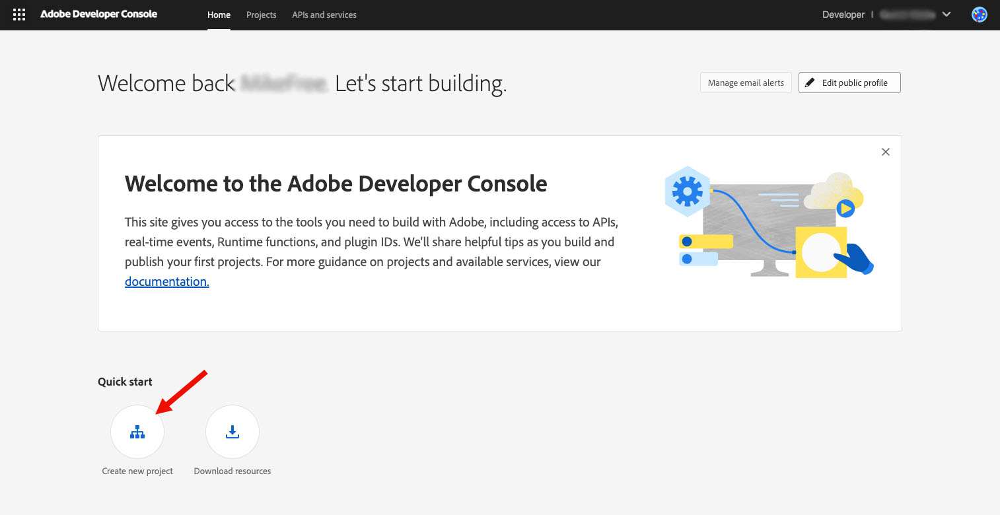

### Step 2: Add API to your project

1. Choose Add API.

   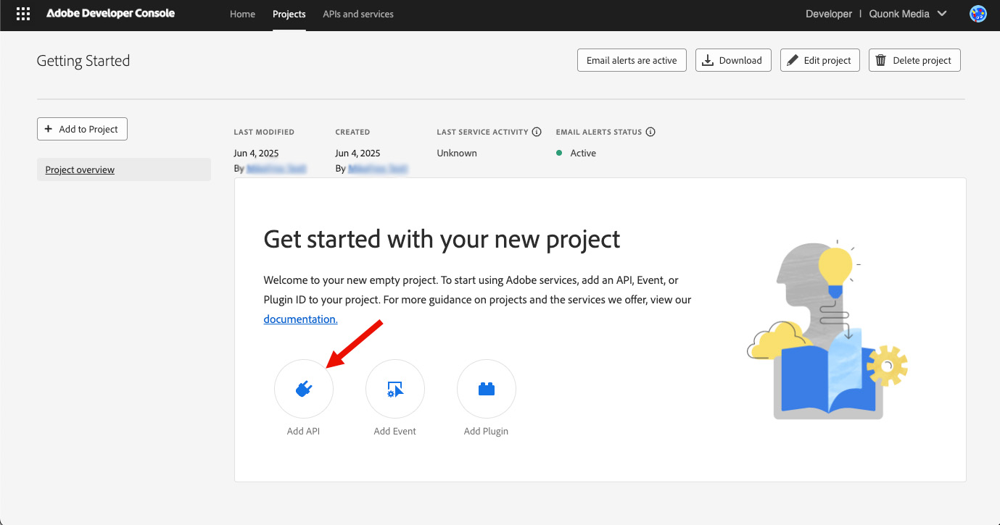

2. Select **Adobe Cloud Storage and Collaboration API** and click Next:

   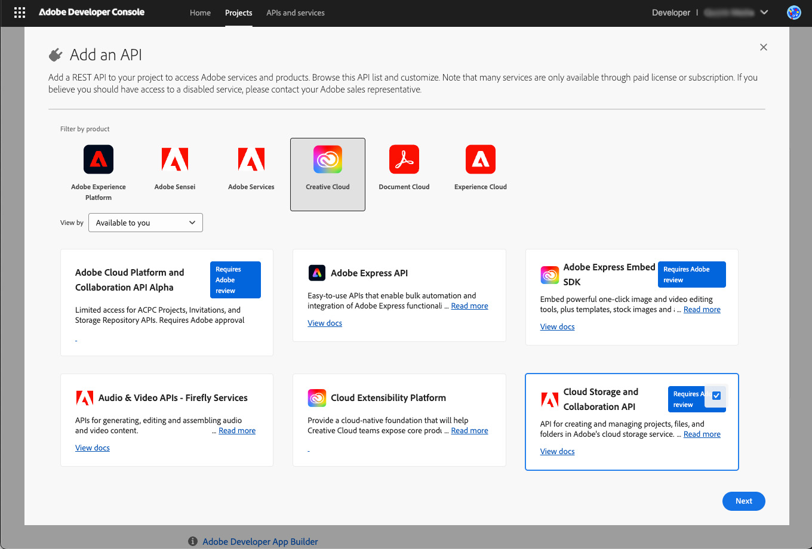

### Step 3: Set Credentials

1. Choose the type of authentication.

   - **Server-to-server Authentication** allows your application's server to generate access tokens and make API calls on behalf of your application itself. Choose this option if your application needs to make API requests when no user is signed in. [Learn more](https://developer.adobe.com/developer-console/docs/guides/authentication/ServerToServerAuthentication/).
   - **User Authentication** enables your application to make API calls on behalf of a signed-in Adobe user. [Learn more](https://developer.adobe.com/developer-console/docs/guides/authentication/UserAuthentication/).

     If you choose User Authentication, you will need to choose the credential type from **OAuth Web App credential** or **OAuth Single Page App credential**. [Learn more](https://developer.adobe.com/developer-console/docs/guides/authentication/UserAuthentication/implementation).

     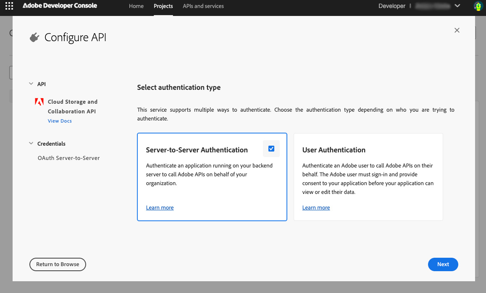

2. Give your credential a name.
3. Click Next.

### Step 4: Select Product Profiles

Depending on the API you add, you may be asked to select product profiles to assign to your credential. These product profiles govern what data your application can/cannot access in your organization.

Choose the appropriate product profile(s) and Click **Save Configured API**.

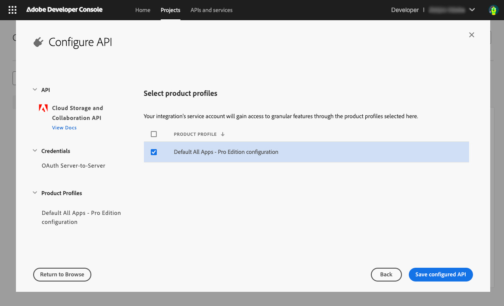

### Step 5: Add More Authentication Credentials and APIs

You can add other credentials using the **Connect another credential** button on the Developer Console project page.

You can add other APIs to your developer project by repeating [step 2](#step-2-add-api-to-your-project) until you have all the APIs your application needs.

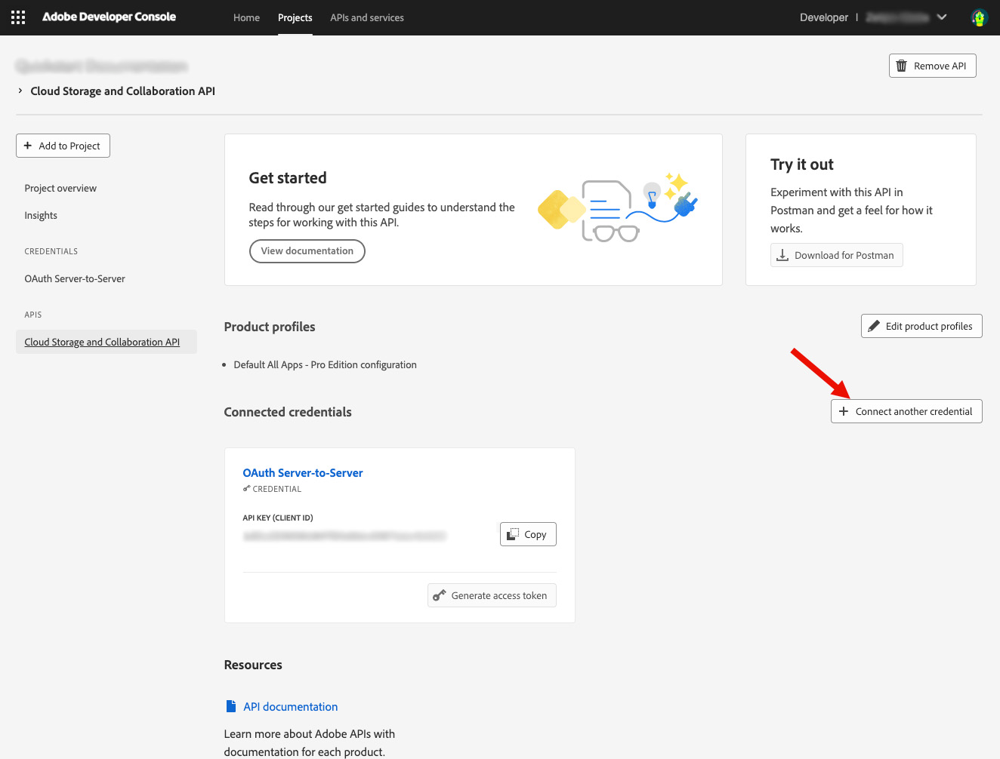

### Step 6: Generate access token

Access tokens can be generated or refreshed in two ways:

- Manual generation: Click **Generate an access token** for quick experimentation using the Developer Console
- Programmatic generation: Click **view the cURL command** to learn how to generate access tokens programmatically. [Learn more](https://developer.adobe.com/developer-console/docs/guides/authentication/ServerToServerAuthentication/implementation/) about how to do it.

#### Scopes

Scopes that are added for your application define what actions or data the clients are allowed to access. Security best practices recommend that your application generates an access token with the least number of scopes it needs to work correctly.

Click **View scopes per service** to understand the services and scopes associated with it.

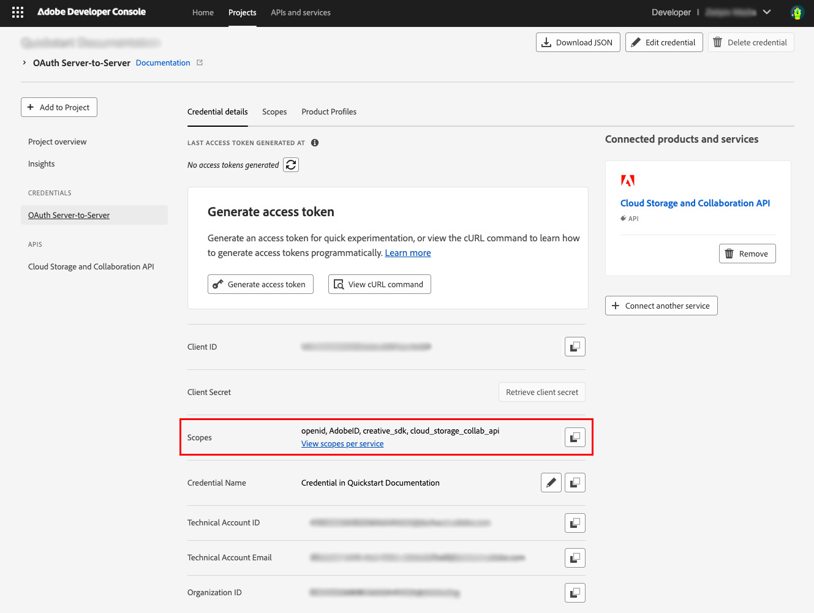

Congratulations! You have just generated an access token.

## Technical Account permissions

Access to content in Adobe cloud storage is limited to authorized users.

API calls made with an OAuth User credential use a user token to make the request on behalf of a specific user. The user's access to the content is based on their [roles and permissions](../concepts/permissions/index.md).

Calls made using OAuth Server-to-Server calls on the other hand are made using a Technical Account. The Technical Account is created automatically when you added Server-to-Server authentication to your Developer Console Project. However, you must grant the Technical Account permissions to allow it to access the Adobe cloud storage conent.

Granting permissions to the Technical Account is done through the [Adobe Admin Console](https://adminconsole.adobe.com). **You must be an Administrator for your organization to grant permissions to the Technical Account**

1. Sign in the [Adobe Admin Console](https://adminconsole.adobe.com) using your user account profile for your organization
2. Go to the _Users_ tab

   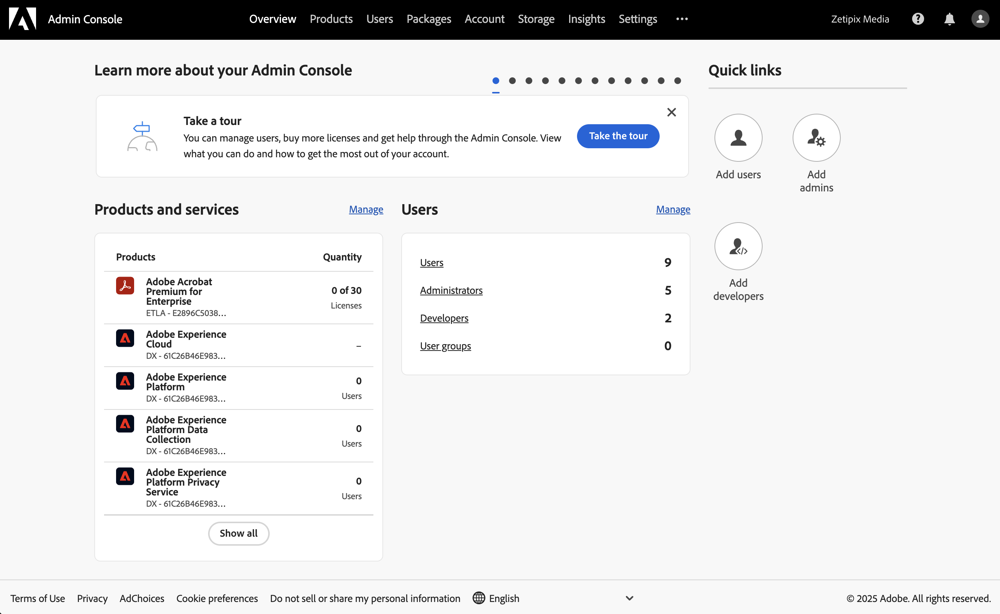

3. Choose _API Credentials_ from the menu on the left
4. Locate the credential you created earlier in the list. Click on the _view details_ icon to see information about the credential.

   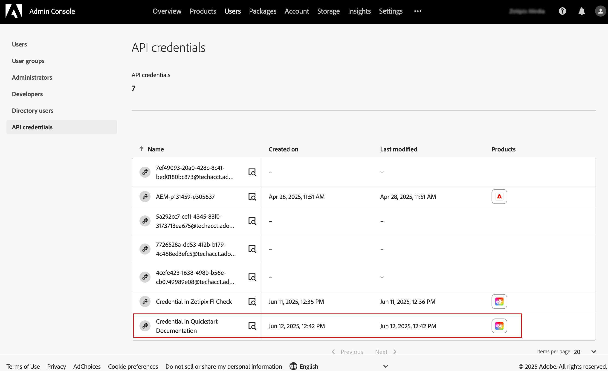

5. Copy the Technical Account's username data

   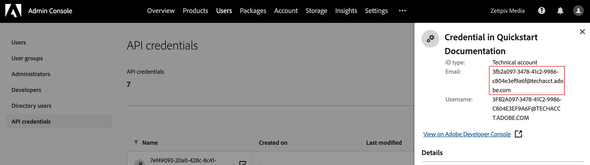

6. Choose _Administrators_ from the menu on the left
7. Click the _Add Admin_ button.

   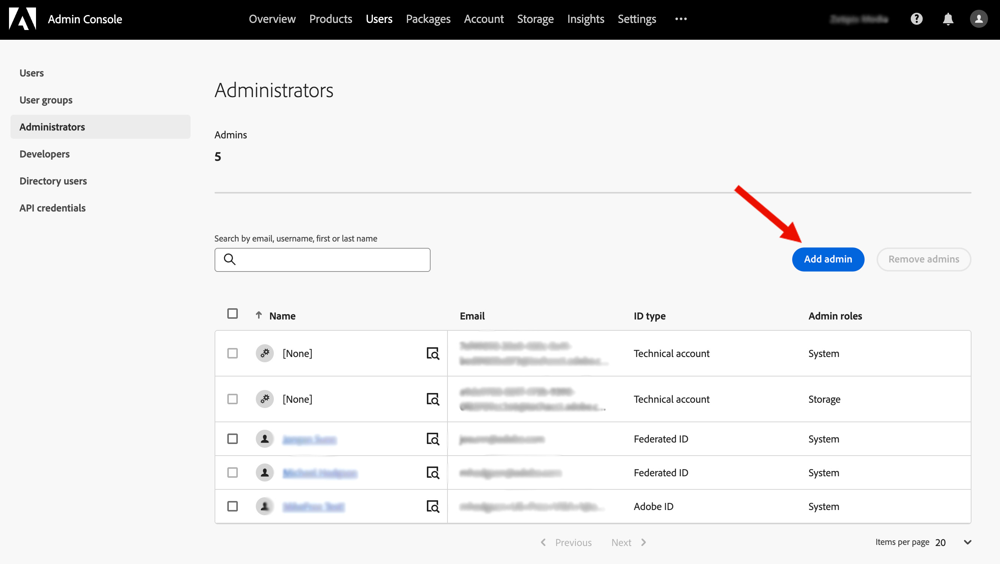

8. Paste the Technical Account's user name in the _Email or username_ field and click the drop down button next to the field.

   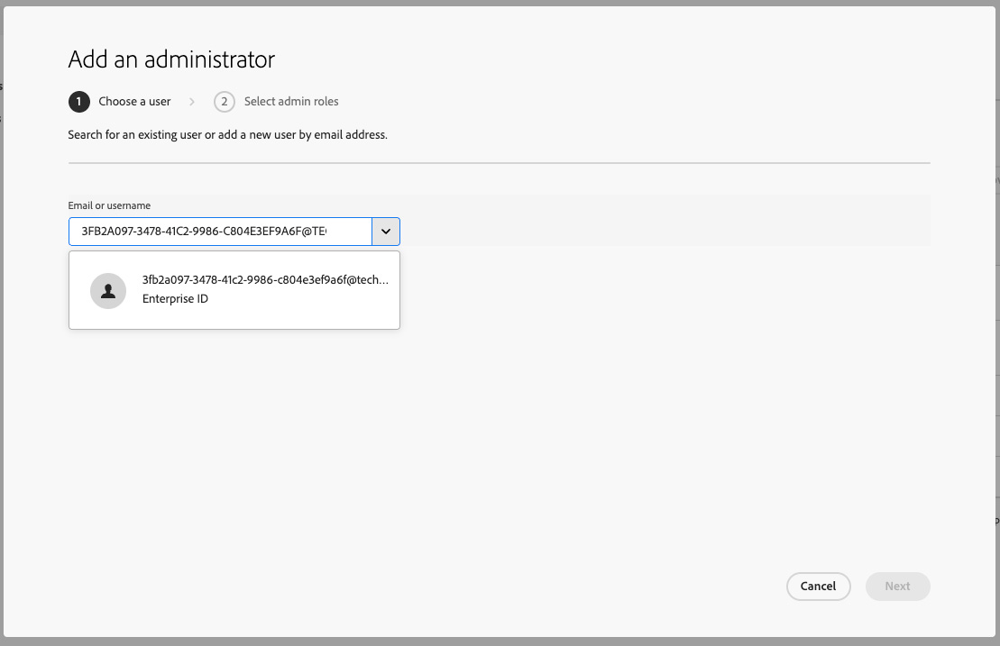

9. Select the user name from the list and click the _Next_ button

   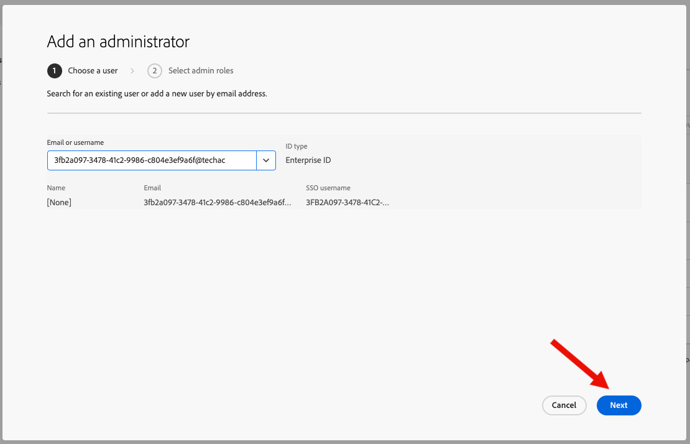

10. Activate teh _Storage administrator_ option and click _Save_. This will make the Technical Account a Storage Administrator, which gives the account access to all of the content in your organization's Adobe cloud storage.

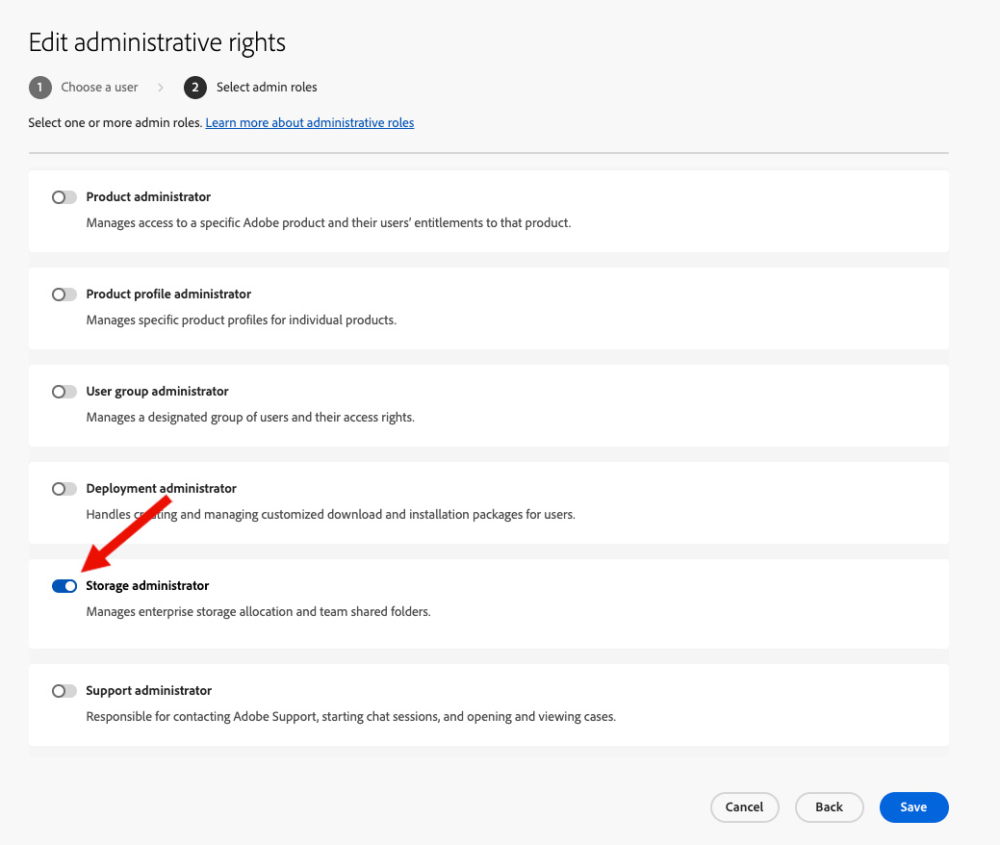

## Make your first API call

Once you have created your access token, you can follow the steps below to make your first API call.

- Open your terminal and paste the code below.
- Replace the variables <YOUR_ACCESS_TOKEN> with the token you generated on the Adobe Developer Console.
- Replace <YOUR_CLIENT_ID>. You can find this on the same page you generated your token on.
- Once all variables have been replaced you can run the command.

```json
curl --request GET \
  --url 'https://cloudstorage.adobe.io/v1//projects?limit=20' \
  --header 'Authorization: Bearer <YOUR_ACCESS_TOKEN>' \
  --header 'Content-Type: application/vnd.adobecloud.directory+json' \
  --header 'x-api-key: <YOUR_CLIENT_ID>'
```

Congratulations! You just made your first request to the Cloud Storage and Collaboration API.

**Note:** that your access token will expire every 24 hours at which time it will need to be refreshed.

Start building your applications
Now that you have obtained an Access Token and Client ID, you can utilize them to develop your application with Cloud Storage and Collaboration API.

The [Quickstart guide](../quickstart/index.md) will provide an example to help you get started.
