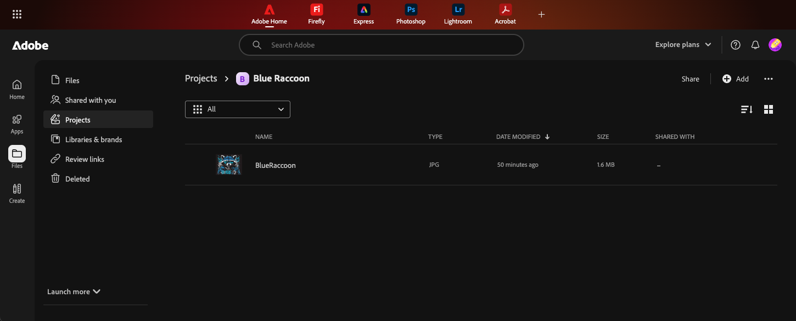

# Work with Cloud Storage and Collaboration APIs

Automating content workflows with Cloud Storage and Collaboration APIs


## Prerequisites

### Credentials

If you don't already have a Cloud Storage and Collaboration **Client ID**, **Client Secret**, and **Scopes** retrieve them from your [Adobe Developer Console project](https://developer.adobe.com/developer-console/docs/guides/services/services-add-api-oauth-s2s/#api-overview) before reading further. **Securely store these credentials and never expose them in client-side or public code**. This tutorial uses a Server-To-Server credential, but Cloud Storage and Collaboration API also supports User credentials.

### Setting up your environment

Before we begin this tutorial, run the following command in a secure terminal:

```bash
mkdir cloud-storage-api-getstarted-tutorial
cd cloud-storage-api-getstarted-tutorial
npm init --y
npm install axios qs
touch index.js
```

Depending on your learning style, you may prefer to walk through this tutorial step-by-step or jump immediately to the [full source code](#full-example).

## Retrieve an Access Token

1. Open a secure terminal and export your **Client ID**, **Client Secret**, and **Scopes** as environment variables so that your later commands can access them:

   ```bash
   export CLOUD_STORAGE_CLIENT_ID=yourClientId
   export CLOUD_STORAGE_CLIENT_SECRET=yourClientSecret
   export CLOUD_STORAGE_SCOPES=yourClientScopes
   ```

2. Generate an access token:

   **cURL**

   ```bash
   curl --location 'https://ims-na1.adobelogin.com/ims/token/v3' \
   --header 'Content-Type: application/x-www-form-urlencoded' \
   --data-urlencode 'grant_type=client_credentials' \
   --data-urlencode "client_id=$CLOUD_STORAGE_CLIENT_ID" \
   --data-urlencode "client_secret=$CLOUD_STORAGE_CLIENT_SECRET" \
   --data-urlencode "scope=$CLOUD_STORAGE_SCOPES'
   ```

   **JavaScript**

   ```js
   // Generate access token
    async function retrieveAccessToken() {
    const CLIENT_ID = process.env.CLOUD_STORAGE_CLIENT_ID;
    const CLIENT_SECRET = process.env.CLOUD_STORAGE_CLIENT_SECRET;
    const SCOPES = process.env.CLOUD_STORAGE_SCOPES;
    console.log("Generating Access Token");
    const data = qs.stringify({
    grant_type: "client_credentials",
    client_id: CLIENT_ID,
    client_secret: CLIENT_SECRET,
    scope: SCOPES,
   });
   const config = {
    method: "post",
    url: "https://ims-na1.adobelogin.com/ims/token/v2",
    headers: { "Content-Type": "application/x-www-form-urlencoded" },
    data: data,
    };
    try {
    const response = await axios.request(config);
    console.log("Access Token Retrieved");
    return response.data.access_token;
    } 
    catch (error) 
    {
    console.error("Error retrieving access token:", error.response.data);
    }
   }
   ```

   The response will look like this:

   ```bash
   {"access_token":"yourAccessTokenAsdf123","token_type":"bearer","expires_in":86399}
   ```

3. Export this access token so that the next script can conveniently access it:

    ```bash
    export CLOUD_STORAGE_SERVICES_ACCESS_TOKEN=yourAccessTokenAsdf123
   ```

## List projects

Now that you have an access token you can begin to work with Adobe Creative Cloud projects. A project is a durable, shared space within your organization. For more information, see: [Creative Cloud projects overview](https://helpx.adobe.com/creative-cloud/help/projects-overview.html).

You can start by getting a list of the existing projects. It is important to note that only projects that the requesting user or Technical Account has access to will be included in the response.

```js
//Get a list of existing projects
async function getProjects(accessToken) {
  {
    console.log("Getting project list.");
    const headers = {
      "Content-Type": "application/json",
      "x-api-key": CLIENT_ID,
      Authorization: `Bearer ${accessToken}`,
    };

    const config = {
      method: "GET",
      url: STORAGE_ENDPOINT + "/projects",
      headers: headers,
    };

    try {
      const response = await axios(config);
      const projectList = response.data;
      console.log("Get existing projects:");
      console.log(JSON.stringify(response.data));
      return projectList;
    } catch (error) {
      console.error("Error during create project:", error.response?.data || error.message);
    }
  }
}
```

Sample response (assuming you have at least one existing Creative Cloud project):

```js
{
  "items": [
    {
      "assetType": "project",
      "assetId": "urn:aaid:sc:US:a62a30fa-3bb9-3e5a-8e1c-c062c0cba1ef",
      "name": "MyProject",
      "createdDate": "2025-06-11T22:19:55.722Z",
      "modifiedDate": "2025-06-11T22:19:55.722Z",
      "createdBy": "0EF41E016849DACA0A49421B@techacct.adobe.com",
      "modifiedBy": "0EF41E016849DACA0A49421B@techacct.adobe.com",
      "path": "/MyProject",
      "ancestors": [],
      "state": "active"
    }
  ]
}
```

## Create a project

Next you can create a new Adobe Cloud Storage project to provide a shared space where the creative production team can store and collaborate on content.

Start by sending a request to create a new project with the name you have selected:

```js
//Create a new project
async function createProject(accessToken, projectName) {
  console.log("Creating new project");
  const headers = {
    "Content-Type": "application/json",
    "x-api-key": CLIENT_ID,
    Authorization: `Bearer ${accessToken}`,
  };
  const data = {
    name: projectName,
  };

  const config = {
    method: "post",
    url: STORAGE_ENDPOINT + "/projects",
    headers: headers,
    data: data,
  };

  try {
    const response = await axios(config);
    const projectId = response.data["assetId"];
    console.log("Create project:");
    console.log(JSON.stringify(response.data));
    return projectId;
  } catch (error) {
    if (error.response.status == 409) {
      try {
        //Project already exists with that name. Get the id for it
        return await getExistingProjectId(accessToken, projectName);
      } catch (error) {
        //if the project exists, but it isn"t in the list of projects, then the user does not have access to it.
        throw new Error("Project named: " + projectName + " exists, but you do not have access to it.");
      }
    } else {
      throw new Error("Error during create project");
    }
  }
}
```

The function checks for a 409 Conflict error, which occurs if a project with the same name already exists. In that case, it attempts to retrieve the existing project’s ID.

For security reasons, if the requestor doesn't have access permission to the existing project, they won't be able to retrieve the project's asset ID and error will be returned.

```js
//get an existing project's asset id
async function getExistingProjectId(accessToken, projectName) {
  const pl = await getProjects(accessToken);
  const projectList = pl.items;

  //find the matching project name in the list of all projects
  const filteredArrayValues = projectList.filter((item) => item.name === projectName);
  if (filteredArrayValues.length == 0) {
    throw new Error("Project name not found: " + projectName);
  } else {
    return filteredArrayValues[0].assetId;
  }
}
```

Sample response for creating a new project:

```js
{
  "assetType": "project",
  "assetId": "urn:aaid:sc:US:a93c94fe-71b6-3ac1-acac-0618bd98fe08",
  "name": "Blue Raccoon",
  "createdDate": "2025-07-07T22:26:58.967Z",
  "modifiedDate": "2025-07-07T22:26:58.967Z",
  "createdBy": "478B1E01684B2D8A0A494234@techacct.adobe.com",
  "modifiedBy": "478B1E01684B2D8A0A494234@techacct.adobe.com",
  "path": "/Blue Raccoon",
  "ancestors": [],
  "state": "active"
}
```

## Get project information

You can retrieve information about a project that is created using either the APIs, or through Adobe Creative Cloud applications such as Adobe Express, Photoshop Web, or Adobe.com.

Get project information using the Cloud Storage and Collaboration API:

```js
//get project info
async function getProjectInfo(accessToken, projectId) {
  console.log("Getting project metadata for project: " + projectId);

  const headers = {
    "x-api-key": CLIENT_ID,
    Authorization: `Bearer ${accessToken}`,
  };

  const config = {
    method: "get",
    url: STORAGE_ENDPOINT + "/projects/" + projectId,
    headers: headers,
  };

  try {
    const response = await axios(config);
    const projectMetadata = response.data;
    console.log("Get project data:");
    console.log(JSON.stringify(response.data));
    return projectMetadata;
  } catch (error) {
    console.error("Error during get project info: ", error.response?.data || error.message);
  }
}
```

Sample response:

```js
{
  "assetType": "project",
  "assetId": "urn:aaid:sc:US:a93c94fe-71b6-3ac1-acac-0618bd98fe08",
  "name": "Blue Raccoon",
  "createdDate": "2025-07-07T22:26:58.967Z",
  "modifiedDate": "2025-07-07T22:26:58.967Z",
  "createdBy": "478B1E01684B2D8A0A494234@techacct.adobe.com",
  "modifiedBy": "478B1E01684B2D8A0A494234@techacct.adobe.com",
  "path": "/Blue Raccoon",
  "ancestors": [],
  "state": "active"
}
```

## Invite a user to a project

To enable collaboration, invite users using their email IDs to the project by assigning them either edit or comment roles.

```js
//set the user role for a project
async function inviteUser(accessToken, projectId, userEmail, userRole) {
    console.log("Adding user to the project");
    const headers = {
        "Content-Type": "application/json",
        "x-api-key": CLIENT_ID,
        Authorization: `Bearer ${accessToken}`,
    };

    const data = {
        "direct": {
            "additions": [
                {
                    "recipient": "mailto:" + userEmail,
                    "type": "user",
                    "role": userRole
                }
            ]
        }
    };

    const config = {
        method: "patch",
        url: STORAGE_ENDPOINT + "/projects/" + projectId + "/permissions",
        headers: headers,
        data: data,
    };

    try {
        const response = await axios(config);
        const inviteResponse = response.data;
        console.log("Set user role:");
        console.log(JSON.stringify(response.data));
        return inviteResponse;
    } catch (error) {
        console.error("Error during invite user: ", error.response?.data || error.message);
    }
```

Sample response:

```js
{
  "direct": {
    "additions": [
      {
        "status": "successful",
        "id": "mailto:user-email@company.com",
        "role": "edit"
      }
    ],
    "updates": [],
    "deletions": []
  }
}
```

## Get project sharing information

Use the API to view which users have access to the project and their assigned roles.

```js
//get project sharing info
async function getSharing(accessToken, projectId) {
  console.log("Getting project sharing data");

  const headers = {
    "x-api-key": CLIENT_ID,
    Authorization: `Bearer ${accessToken}`,
  };

  const config = {
    method: "GET",
    url: STORAGE_ENDPOINT + "/projects/" + projectId + "/permissions",
    headers: headers,
  };

  try {
    const response = await axios(config);
    const projectSharingData = response.data;
    console.log("Get project sharing info:");
    console.log(JSON.stringify(response.data));
    return projectSharingData;
  } catch (error) {
    console.error("Error getting project sharing info: ", error.response?.data || error.message);
  }
}
```

Sample response:

```js
{
  "direct": [],
  "pending": [
    {
      "email": "user-email@company.com",
      "role": "edit",
      "created": "2025-07-07T22:27:00.424Z",
      "id": "mailto:user-email@company.com"
    }
  ]
}
```

## Upload a file to a project

You can use the Cloud Storage and Collaboration APIs to upload a file to a project. In this example, a JPG file located in the same directory as your application (cloud-storage-api-getstarted-tutorial) will be uploaded.

File uploading is an asynchronous action that involves several steps.

### Initiate Upload

Start by reading the file and notifying Adobe Cloud Storage that a file upload is about to begin.

```js
//upload a file
async function uploadFile(accessToken, projectId, fileName) {

    //read the image file from the local directory
    console.log("Reading local file");
    var imgPath = __dirname + "/" + fileName;
    var fileData;
    const fsFile = await fs.readFile(imgPath)
        .then((data) => {
            fileData = Buffer.from(data);
        })
        .catch((error) => {
            console.error("Error reading file:", error);
        });


    //Init the file upload
    console.log("Initializing the upload");
    var headers = {
        "x-api-key": CLIENT_ID,
        "Content-Type": 'application/json',
        accept: ' application/json',
        Authorization: `Bearer ${accessToken}`,
    };

    //Assumes the file is small and can be handled with 1 block
    var data = {
        size: fileData.length,
        parentId: projectId,
        name: fileName,
        mediaType: "image/jpeg",
        blockSize: fileData.length,
    };

    var config = {
        method: "post",
        url: STORAGE_ENDPOINT + "/files/upload/init",
        headers: headers,
        data: data,
    };

    var fileInitData = "";
    try {
        var response = await axios(config);
        fileInitData = response.data;
        console.log("Init file upload: ");
        console.log(JSON.stringify(response.data));
    } catch (error) {
        console.error("Error initilizing file upload: ", error.response?.data || error.message);
    }

```

The response will include an `uploadId` that you can use to identify the upload operation, and one or more `transferLinks` that provide a location to put the file's data. If the file is large, you will have multiple `transferLinks`, each with its own `partNumber`. You will upload each of the file's blocks to its own transfer link.

Sample response for a small (one block) file:

```js
{
  "uploadId": "VA6:38ea6685-4708-4c20-9720-9caf4d0d35c2",
  "blockSize": 10485760,
  "urlExpirationDate": "2025-07-08T04:27:00.841Z",
  "transferLinks": [
    {
      "url": "https://aep-cs-blobstore-stage-va6-data.s3.amazonaws.com/temp/a.....",
      "partNumber": 1
    }
  ]
}
```

### Upload Blocks

Upload the file block(s) to the provided pre-signed URL(s). Do not include an Authorization header for this request, as the transfer link is a pre-signed URL.

```js
//upload block to presigned URL
console.log("Uploading file to presigned URL");
const uploadId = fileInitData.uploadId;
const transferLink = fileInitData.transferLinks[0].url;

headers = {
  "Content-Type": "image/jpeg",
};

var param = {
  partNumber: "1",
};

config = {
  method: "put",
  url: transferLink,
  headers: headers,
  data: fileData,
  params: param,
};

try {
  var response = await axios(config);
} catch (error) {
  console.error("Error uploading file to presigned URL: ", error.response?.data || error.message);
}
```

### Finalize the Upload

After all file blocks have been uploaded, the next step is to finalize the upload. This involves making a POST request to the finalize endpoint, passing the uploadId (from the initialization step) and an array of part numbers that correspond to the transferLinks used during the upload.

```js
//finalize the file upload
console.log("Finalizing the upload");
headers = {
  "x-api-key": CLIENT_ID,
  "Content-Type": "application/json",
  accept: " application/json",
  Authorization: `Bearer ${accessToken}`,
};

data = {
  uploadId: uploadId,
  usedTransferLinks: [1],
};

config = {
  method: "post",
  url: STORAGE_ENDPOINT + "/files/upload/finalize",
  headers: headers,
  data: data,
};

var jobId = "";
try {
  var response = await axios(config);
  jobId = response.data.jobId;
  console.log("Finalize file upload:");
  console.log(JSON.stringify(response.data));
} catch (error) {
  console.error("Error finalizing the upload: ", error.response?.data || error.message);
}
```

The finalize function returns a `jobId` that you will use to check the status of the upload request

```js
{"jobId":"VkE2OjA6OTBiODY2M2QtNjRhNC00NmJkLThlMTUtZTVlNmExMTU3Yzk3"}
```

### Monitor status

You can check on the status of the upload by using the GET status function with the `jobId` from the finalize function.

```js
    //Get the status and the asset id
    console.log("Get the status of the upload");
    headers = {
        "x-api-key": CLIENT_ID,
        "Content-Type": 'application/json',
        accept: ' application/json',
        Authorization: `Bearer ${accessToken}`,
    };

    data = {
        "uploadId": fileInitData.uploadId,
        "usedTransferLinks": [1]
    }

    config = {
        method: "get",
        url: STORAGE_ENDPOINT + "/status/" + jobId,
        headers: headers,
        data: data,
    };

    var jobStatus = "";
    //loop unitl the status indicates the file is ready
    while (jobStatus != "succeeded") {
        const delay = ms => new Promise(resolve => setTimeout(resolve, ms))
        await delay(500) /// wait 500ms before checking
        try {
            var response = await axios(config);
            jobStatus = response.data.status;
            console.log("Get upload status:");
            console.log(JSON.stringify(response.data));
        } catch (error) {
            console.error("Error getting the upload status: ", error.response?.data || error.message);
        }
    }

    return response.data.asset.assetId;  //return the asset id for the uploaded file
}
```

When the operation is complete, the status will be updated to "succeeded", and the response will include the asset ID for the uploaded file:

```js
{
  "jobType": "file_upload",
  "jobId": "VkE2OjA6OTBiODY2M2QtNjRhNC00NmJkLThlMTUtZTVlNmExMTU3Yzk3",
  "requestId": "3b48a371-098e-4ae3-900c-a075d10fa01e",
  "status": "succeeded",
  "asset": {
    "assetType": "file",
    "assetId": "urn:aaid:sc:US:9c528050-3c56-3949-b08b-a40593e6c0de",
    "name": "BlueRaccoon.jpg",
    "createdDate": "2025-07-07T22:27:02.18Z",
    "modifiedDate": "2025-07-07T22:27:02.18Z",
    "createdBy": "478B1E01684B2D8A0A494234@techacct.adobe.com",
    "modifiedBy": "478B1E01684B2D8A0A494234@techacct.adobe.com",
    "path": "/projects/Blue Raccoon/BlueRaccoon.jpg",
    "ancestors": [
      "urn:aaid:sc:US:13fbacea-747b-40f6-bc78-20236ae8befc",
      "urn:aaid:sc:US:612f0d35-0c56-378f-8a66-37eb6b32fb99",
      "urn:aaid:sc:US:a93c94fe-71b6-3ac1-acac-0618bd98fe08"
    ],
    "state": "active",
    "mediaType": "image/jpeg",
    "size": 1631222,
    "contentEtag": "\"e1d1f162-d28b-41b8-89b9-3a37aa02eddc\""
  }
}
```

## List the contents of a project

After the file is uploaded, you can retrieve the contents of the project, including all files and folders created through the API, or added through Creative Cloud applications.

```js
//get a list of the files/folders in a project
async function getProjectContents(accessToken, projectId) {
  console.log("Getting a list of the project's contents");

  const headers = {
    "Content-Type": "application/json",
    "x-api-key": CLIENT_ID,
    Authorization: `Bearer ${accessToken}`,
  };

  const config = {
    method: "get",
    url: STORAGE_ENDPOINT + "/projects/" + projectId + "/list", //
    headers: headers,
  };

  try {
    const response = await axios(config);
    const projectContents = response.data.items;
    console.log("Get projects file/folder list:");
    console.log(JSON.stringify(response.data));
    return projectContents;
  } catch (error) {
    console.error("Error during get project contents: ", error.response?.data || error.message);
  }
}
```

Sample response:

```js
{
  "items": [
    {
      "assetType": "file",
      "assetId": "urn:aaid:sc:US:9c528050-3c56-3949-b08b-a40593e6c0de",
      "name": "BlueRaccoon.jpg",
      "createdDate": "2025-07-07T22:27:02.18Z",
      "modifiedDate": "2025-07-07T22:27:02.18Z",
      "createdBy": "478B1E01684B2D8A0A494234@techacct.adobe.com",
      "modifiedBy": "478B1E01684B2D8A0A494234@techacct.adobe.com",
      "path": "/Blue Raccoon/BlueRaccoon.jpg",
      "ancestors": [
        "urn:aaid:sc:US:a93c94fe-71b6-3ac1-acac-0618bd98fe08"
      ],
      "state": "active",
      "mediaType": "image/jpeg",
      "size": 1631222
    }
  ]
}
```

## Get a rendition of a file

You can use the Cloud Storage and Collaboration API to generate a rendition of an asset stored in Adobe Cloud Storage. A rendition is a simplified or transformed version of the original file, commonly used for thumbnails or previews. For example, a thumbnail is a smaller, often compressed version of an image.

```js
//get a file rendition
async function getFileRendition(accessToken, fileId, renditionSize, renditionFileName) {
  console.log("Getting a rendition of the file");

  const headers = {
    "Content-Type": "image/jpg",
    "x-api-key": CLIENT_ID,
    Authorization: `Bearer ${accessToken}`,
  };

  param = {
    size: renditionSize,
    mediaType: "image/jpeg",
  };

  const config = {
    method: "get",
    url: STORAGE_ENDPOINT + "/files/" + fileId + "/image-rendition",
    headers: headers,
    params: param,
    responseType: "stream",
  };

  try {
    const finishedDownload = ut.promisify(stream.finished);
    const renditionFilePath = __dirname + "/" + renditionFileName;
    const writer = ws.createWriteStream(renditionFilePath);
    const response = await axios(config);

    response.data.pipe(writer);
    await finishedDownload(writer);
    console.log("Rendition written: " + renditionFilePath);
  } catch (error) {
    console.error("Error during get file rendition: ", error.response?.data || error.message);
  }
}
```

In this example, the rendition is saved to the same directory as your application (cloud-storage-api-getstarted-tutorial) under the specified filename, such as rendition.jpg. You can open the file to verify that the image has been resized or compressed as expected.


## Download a file

You can download binary files to your client application using the _download_ function.

**Note:** Download is not supported for cloud-native files such as Cloud Documents, Brands, and Libraries. For more details on supported file types, refer to  [Collaboration Constructs](../overview/constructs.md).

```js
//Download a file
async function downloadFile(accessToken, fileId, downloadFileName) {
  console.log("Downloading the file");

  const headers = {
    "Content-Type": "image/jpg",
    "x-api-key": CLIENT_ID,
    Authorization: `Bearer ${accessToken}`,
  };

  const config = {
    method: "get",
    url: STORAGE_ENDPOINT + "/files/" + fileId + "/download",
    headers: headers,
  };

  try {
    const response = await axios(config);
    const presignedURL = response.data.url;
    console.log("Download file:");
    console.log(JSON.stringify(response.data));
    await downloadFromPresignedURL(presignedURL, downloadFileName);
  } catch (error) {
    console.error("Error during file download - presigned URL version: ", error.response?.data || error.message);
  }
}
```

Sample response:

```js
{
  "url": "https://aep-cs-blobstore-stage-va6-data.s3.amazonaws.com/d...",
  "urlExpirationDate": "2025-07-08T02:27:03Z",
  "size": 1631222,
  "mediaType": "image/jpeg"
}
```

The Cloud Storage and Collaboration API's download function will return a pre-signed URL from which you can download the requested file.

```js
//download a file from a pre-signed URL
async function downloadFromPresignedURL(presignedURL, downloadFileName) {
  const headers = {
    "Content-Type": "image/jpg",
  };
  const config = {
    method: "get",
    url: presignedURL,
    headers: headers,
    responseType: "stream",
  };

  try {
    const finishedDownload = ut.promisify(stream.finished);
    const downloadFilePath = __dirname + "/" + downloadFileName;
    const writer = ws.createWriteStream(downloadFilePath);
    const response = await axios(config);

    response.data.pipe(writer);
    await finishedDownload(writer);
    console.log("File downloaded: " + downloadFilePath);
  } catch (error) {
    console.error("Error during download file ", error.response?.data || error.message);
  }
}
```

In this example, the resulting rendition is saved to the same location as our application (_cloud-storage-api-getstarted-tutorial_) with the name _download.jpg_. You can open the file to verify that it matches the original upload.

## View project in UI

To view the project and its contents in the [Adobe Creative Clound Home](https://www.adobe.com/home):

1. Open a browser and navigate to the [Adobe Creative Cloud Home](https://www.adobe.com/home).
2. Sign in as the user that you invited to the project in the **[Invite a user to a project](#invite-a-user-to-a-project)** step.
3. Click on the bell icon in the upper right of the screen to view the list of notifications.
4. Click on the notification about the invite to the project. This will take you to the project

Alternatively, you can navigate manually:

1. Click the Files icon.
2. Select Projects from the sidebar.
3. Locate and click on the project you created.

The content of the project will be shown, including the file you uploaded through the API.

  

## Full example

```js
/*
Sample code for Cloud Storage and Collaboration API Quickstart

Uses the Cloud Storage and Collaboration API
*/

const axios = require("axios");
const qs = require("qs");
const fs = require("fs").promises;
const ws = require("fs");
const stream = require("stream");
const ut = require("util");

const ROLES = {
  Editor: "edit",
  Commenter: "comment",
};

//read the client id, client secret, and scopes from the environment variables
const CLIENT_ID = process.env.CLOUD_STORAGE_CLIENT_ID;
const CLIENT_SECRET = process.env.CLOUD_STORAGE_CLIENT_SECRET;
const SCOPES = process.env.CLOUD_STORAGE_SCOPES;

const STORAGE_ENDPOINT = "https://cloudstorage.adobe.io/v1";

(async () => {
  try {
    const accessToken = await retrieveAccessToken();

    //Get a list of existing projects
    const projectList = await getProjects(accessToken);

    //Create a new Project
    var projectName = "Blue Raccoon";
    const projectId = await createProject(accessToken, projectName);
    console.log("Project id: " + projectId);

    //Get info about a project
    var projectInfo = await getProjectInfo(accessToken, projectId);

    //Invite a user to a project
    var userEmail = "user-email@company.com";
    var userRole = ROLES.Editor;
    var inviteUserResponse = await inviteUser(accessToken, projectId, userEmail, userRole);

    //Get the project's sharing info (all users)
    var projectSharing = await getSharing(accessToken, projectId);

    //Upload an image file to a project
    const fileName = "BlueRaccoon.jpg";
    const fileId = await uploadFile(accessToken, projectId, fileName);
    console.log("File id:");
    console.log(fileId);

    //List project contents
    const projectContents = await getProjectContents(accessToken, projectId);

    //Get a rendition of a file
    const renditionSize = 100;
    const renditionFileName = "rendition.jpg";
    const renditionFileData = await getFileRendition(accessToken, fileId, renditionSize, renditionFileName);

    //Download a file
    const downloadFileName = "download.jpg";
    const fileDownloadData = await downloadFile(accessToken, fileId, downloadFileName);
  } catch {
    console.error("Error executing quickstart. ", error.response?.data || error.message);
  }
})();

// Generate access token
async function retrieveAccessToken() {
  console.log("Generating Access Token");

  const data = qs.stringify({
    grant_type: "client_credentials",
    client_id: CLIENT_ID,
    client_secret: CLIENT_SECRET,
    scope: SCOPES,
  });

  const config = {
    method: "post",
    url: "https://ims-na1.adobelogin.com/ims/token/v2",
    headers: { "Content-Type": "application/x-www-form-urlencoded" },
    data: data,
  };

  try {
    const response = await axios.request(config);
    console.log("Access Token Retrieved");
    return response.data.access_token;
  } catch (error) {
    console.error("Error retrieving access token:", error.response.data);
  }
}

//Get a list of existing projects
async function getProjects(accessToken) {
  {
    console.log("Getting project list.");
    const headers = {
      "Content-Type": "application/json",
      "x-api-key": CLIENT_ID,
      Authorization: `Bearer ${accessToken}`,
    };

    const config = {
      method: "GET",
      url: STORAGE_ENDPOINT + "/projects",
      headers: headers,
    };

    try {
      const response = await axios(config);
      const projectList = response.data;
      console.log("Get existing projects:");
      console.log(JSON.stringify(response.data));
      return projectList;
    } catch (error) {
      console.error("Error during create project:", error.response?.data || error.message);
    }
  }
}

//Create a new project
async function createProject(accessToken, projectName) {
  console.log("Creating new project");
  const headers = {
    "Content-Type": "application/json",
    "x-api-key": CLIENT_ID,
    Authorization: `Bearer ${accessToken}`,
  };
  const data = {
    name: projectName,
  };

  const config = {
    method: "post",
    url: STORAGE_ENDPOINT + "/projects",
    headers: headers,
    data: data,
  };

  try {
    const response = await axios(config);
    const projectId = response.data["assetId"];
    console.log("Create project:");
    console.log(JSON.stringify(response.data));
    return projectId;
  } catch (error) {
    if (error.response.status == 409) {
      try {
        //Project already exists with that name. Get the id for it
        return await getExistingProjectId(accessToken, projectName);
      } catch (error) {
        //if the project exists, but it isn"t in the list of projects, then the user does not have access to it.
        throw new Error("Project named: " + projectName + " exists, but you do not have access to it.");
      }
    } else {
      throw new Error("Error during create project");
    }
  }
}

//get an existing project's asset id
async function getExistingProjectId(accessToken, projectName) {
  const pl = await getProjects(accessToken);
  const projectList = pl.items;

  //find the matching project name in the list of all projects
  const filteredArrayValues = projectList.filter((item) => item.name === projectName);
  if (filteredArrayValues.length == 0) {
    throw new Error("Project name not found: " + projectName);
  } else {
    return filteredArrayValues[0].assetId;
  }
}

//get project info
async function getProjectInfo(accessToken, projectId) {
  console.log("Getting project metadata for project: " + projectId);

  const headers = {
    "x-api-key": CLIENT_ID,
    Authorization: `Bearer ${accessToken}`,
  };

  const config = {
    method: "get",
    url: STORAGE_ENDPOINT + "/projects/" + projectId,
    headers: headers,
  };

  try {
    const response = await axios(config);
    const projectMetadata = response.data;
    console.log("Get project data:");
    console.log(JSON.stringify(response.data));
    return projectMetadata;
  } catch (error) {
    console.error("Error during get project info: ", error.response?.data || error.message);
  }
}

//set the user role for a project
async function inviteUser(accessToken, projectId, userEmail, userRole) {
  console.log("Adding user to the project");
  const headers = {
    "Content-Type": "application/json",
    "x-api-key": CLIENT_ID,
    Authorization: `Bearer ${accessToken}`,
  };

  const data = {
    direct: {
      additions: [
        {
          recipient: "mailto:" + userEmail,
          type: "user",
          role: userRole,
        },
      ],
    },
  };

  const config = {
    method: "patch",
    url: STORAGE_ENDPOINT + "/projects/" + projectId + "/permissions",
    headers: headers,
    data: data,
  };

  try {
    const response = await axios(config);
    const inviteResponse = response.data;
    console.log("Set user role:");
    console.log(JSON.stringify(response.data));
    return inviteResponse;
  } catch (error) {
    console.error("Error during invite user: ", error.response?.data || error.message);
  }
}

//get project sharing info
async function getSharing(accessToken, projectId) {
  console.log("Getting project sharing data");

  const headers = {
    "x-api-key": CLIENT_ID,
    Authorization: `Bearer ${accessToken}`,
  };

  const config = {
    method: "GET",
    url: STORAGE_ENDPOINT + "/projects/" + projectId + "/permissions",
    headers: headers,
  };

  try {
    const response = await axios(config);
    const projectSharingData = response.data;
    console.log("Get project sharing info:");
    console.log(JSON.stringify(response.data));
    return projectSharingData;
  } catch (error) {
    console.error("Error getting project sharing info: ", error.response?.data || error.message);
  }
}

//upload a file
async function uploadFile(accessToken, projectId, fileName) {
  //read the image file from the local directory
  console.log("Reading local file");
  var imgPath = __dirname + "/" + fileName;
  var fileData;
  const fsFile = await fs
    .readFile(imgPath)
    .then((data) => {
      fileData = Buffer.from(data);
    })
    .catch((error) => {
      console.error("Error reading file:", error);
    });

  //Init the file upload
  console.log("Initializing the upload");
  var headers = {
    "x-api-key": CLIENT_ID,
    "Content-Type": "application/json",
    accept: " application/json",
    Authorization: `Bearer ${accessToken}`,
  };

  //Assumes the file is small and can be handled with 1 block
  var data = {
    size: fileData.length,
    parentId: projectId,
    name: fileName,
    mediaType: "image/jpeg",
    blockSize: fileData.length,
  };

  var config = {
    method: "post",
    url: STORAGE_ENDPOINT + "/files/upload/init",
    headers: headers,
    data: data,
  };

  var fileInitData = "";
  try {
    var response = await axios(config);
    fileInitData = response.data;
    console.log("Init file upload: ");
    console.log(JSON.stringify(response.data));
  } catch (error) {
    console.error("Error initilizing file upload: ", error.response?.data || error.message);
  }

  //upload block to presigned URL
  console.log("Uploading file to presigned URL");
  const uploadId = fileInitData.uploadId;
  const transferLink = fileInitData.transferLinks[0].url;

  headers = {
    "Content-Type": "image/jpeg",
  };

  var param = {
    partNumber: "1",
  };

  config = {
    method: "put",
    url: transferLink,
    headers: headers,
    data: fileData,
    params: param,
  };

  try {
    var response = await axios(config);
  } catch (error) {
    console.error("Error uploading file to presigned URL: ", error.response?.data || error.message);
  }

  //finalize the file upload
  console.log("Finalizing the upload");
  headers = {
    "x-api-key": CLIENT_ID,
    "Content-Type": "application/json",
    accept: " application/json",
    Authorization: `Bearer ${accessToken}`,
  };

  data = {
    uploadId: uploadId,
    usedTransferLinks: [1],
  };

  config = {
    method: "post",
    url: STORAGE_ENDPOINT + "/files/upload/finalize",
    headers: headers,
    data: data,
  };

  var jobId = "";
  try {
    var response = await axios(config);
    jobId = response.data.jobId;
    console.log("Finalize file upload:");
    console.log(JSON.stringify(response.data));
  } catch (error) {
    console.error("Error finalizing the upload: ", error.response?.data || error.message);
  }

  //Get the status and the asset id
  console.log("Get the status of the upload");
  headers = {
    "x-api-key": CLIENT_ID,
    "Content-Type": "application/json",
    accept: " application/json",
    Authorization: `Bearer ${accessToken}`,
  };

  data = {
    uploadId: fileInitData.uploadId,
    usedTransferLinks: [1],
  };

  config = {
    method: "get",
    url: STORAGE_ENDPOINT + "/status/" + jobId,
    headers: headers,
    data: data,
  };

  var jobStatus = "";
  //loop until the status indicates the file is ready
  while (jobStatus != "succeeded") {
    const delay = (ms) => new Promise((resolve) => setTimeout(resolve, ms));
    await delay(500); /// wait 500ms before checking
    try {
      var response = await axios(config);
      jobStatus = response.data.status;
      console.log("Get upload status:");
      console.log(JSON.stringify(response.data));
    } catch (error) {
      console.error("Error getting the upload status: ", error.response?.data || error.message);
    }
  }

  return response.data.asset.assetId; //return the asset id for the uploaded file
}

//get a list of the files/folders in a project
async function getProjectContents(accessToken, projectId) {
  console.log("Getting a list of the project's contents");

  const headers = {
    "Content-Type": "application/json",
    "x-api-key": CLIENT_ID,
    Authorization: `Bearer ${accessToken}`,
  };

  const config = {
    method: "get",
    url: STORAGE_ENDPOINT + "/projects/" + projectId + "/list", //
    headers: headers,
  };

  try {
    const response = await axios(config);
    const projectContents = response.data.items;
    console.log("Get projects file/folder list:");
    console.log(JSON.stringify(response.data));
    return projectContents;
  } catch (error) {
    console.error("Error during get project contents: ", error.response?.data || error.message);
  }
}

//get a file rendition
async function getFileRendition(accessToken, fileId, renditionSize, renditionFileName) {
  console.log("Gettting a rendition of the file");

  const headers = {
    "Content-Type": "image/jpg",
    "x-api-key": CLIENT_ID,
    Authorization: `Bearer ${accessToken}`,
  };

  param = {
    size: renditionSize,
    mediaType: "image/jpeg",
  };

  const config = {
    method: "get",
    url: STORAGE_ENDPOINT + "/files/" + fileId + "/image-rendition",
    headers: headers,
    params: param,
    responseType: "stream",
  };

  try {
    const finishedDownload = ut.promisify(stream.finished);
    const renditionFilePath = __dirname + "/" + renditionFileName;
    const writer = ws.createWriteStream(renditionFilePath);
    const response = await axios(config);

    response.data.pipe(writer);
    await finishedDownload(writer);
    console.log("Rendition written: " + renditionFilePath);
  } catch (error) {
    console.error("Error during get file rendition: ", error.response?.data || error.message);
  }
}

//Download a file
async function downloadFile(accessToken, fileId, downloadFileName) {
  console.log("Downloading the file");

  const headers = {
    "Content-Type": "image/jpg",
    "x-api-key": CLIENT_ID,
    Authorization: `Bearer ${accessToken}`,
  };

  const config = {
    method: "get",
    url: STORAGE_ENDPOINT + "/files/" + fileId + "/download",
    headers: headers,
  };

  try {
    const response = await axios(config);
    const presignedURL = response.data.url;
    console.log("Download file:");
    console.log(JSON.stringify(response.data));
    await downloadFromPresignedURL(presignedURL, downloadFileName);
  } catch (error) {
    console.error("Error during file download - presigned URL version: ", error.response?.data || error.message);
  }
}

//download a file from a presigned URL
async function downloadFromPresignedURL(presignedURL, downloadFileName) {
  const headers = {
    "Content-Type": "image/jpg",
  };
  const config = {
    method: "get",
    url: presignedURL,
    headers: headers,
    responseType: "stream",
  };

  try {
    const finishedDownload = ut.promisify(stream.finished);
    const downloadFilePath = __dirname + "/" + downloadFileName;
    const writer = ws.createWriteStream(downloadFilePath);
    const response = await axios(config);

    response.data.pipe(writer);
    await finishedDownload(writer);
    console.log("File downloaded: " + downloadFilePath);
  } catch (error) {
    console.error("Error during download file ", error.response?.data || error.message);
  }
}
```

## Deepen your understanding

his quick start guide provides only a sample of what Cloud Storage and Collaboration APIs can do. To fully explore the available features, functions, and configuration options, refer to [API Reference](../../api/index.md).
